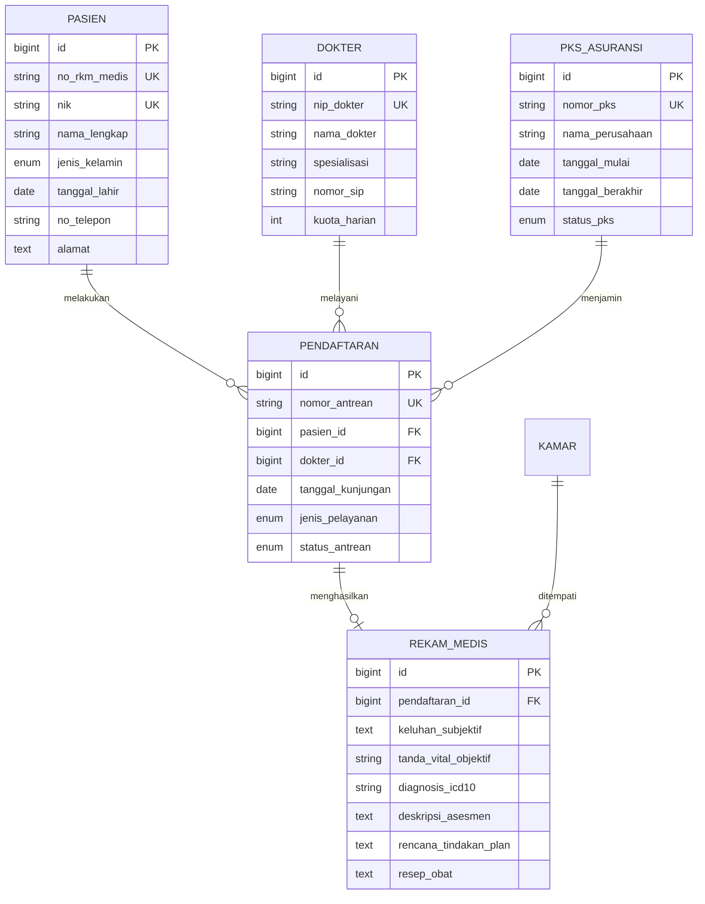

# 🏥 SIMRS Laravel — Enterprise Hospital Management Information System

[](https://laravel.com)
[](https://php.net)
[](https://mysql.com)
[](https://github.com/InfiniteNull/simrs-laravel)
[](https://opensource.org/licenses/MIT)

> **Sistem Informasi Manajemen Rumah Sakit (SIMRS) Terintegrasi** yang dirancang dengan standar Clean Code, Arsitektur MVC & Service Layer, Electronic Medical Record (RME SOAP & ICD-10 Kemenkes), Bed Occupancy Rate (BOR) Analytics Engine, dan Sistem Monitoring Masa Berlaku PKS Asuransi.

---

## 🌟 Live Demo Interaktif di Web Portofolio

Aplikasi ini dapat dicoba secara interaktif langsung melalui browser tanpa instalasi backend:
👉 **[https://infinitenull.github.io/](https://infinitenull.github.io/)** (Buka tab *Project 2: SIMRS Laravel*)

---

## 📋 Cakupan Modul & Keselarasan Kurikulum SIMRS (13 Modul)

Proyek ini mengimplementasikan seluruh kebutuhan kurikulum operasional SIMRS Rumah Sakit:

| No | Modul & Fitur SIMRS | Deskripsi & Implementasi Teknis | Status |
|---|---|---|---|
| **1** | **Manual Book & SOP SIMRS** | Dokumentasi operasional SIMRS terintegrasi untuk layanan medis & non-medis. | ✅ Lengkap |
| **2** | **Dashboard SIMRS & Analitik Layanan** | Visualisasi KPI rumah sakit, BOR, ALOS, TOI, BTO, dan tren kunjungan pasien. | ✅ Lengkap |
| **3** | **Pendaftaran Online & Rencana Kontrol** | Registrasi pasien baru/lama, penjadwalan dokter poli, dan nomor antrean otomatis. | ✅ Lengkap |
| **4** | **Monitoring PKS Asuransi** | Sistem pelacakan masa berlaku kontrak kerjasama BPJS, Asuransi Swasta, & alert expired. | ✅ Lengkap |
| **5** | **RME Rawat Jalan (SOAP & ICD-10)** | Pengisian asesmen Subjective, Objective, Assessment (ICD-10), & Plan terapi dokter. | ✅ Lengkap |
| **6** | **RME Rawat Inap & IGD Triage** | Manajemen rekam medis kamar rawat inap, status triage IGD, dan histori tindakan. | ✅ Lengkap |
| **7** | **Master Data Dokter & Poliklinik** | Pengelolaan SIP dokter, jadwal praktik poliklinik, dan kuota harian pasien. | ✅ Lengkap |
| **8** | **Manajemen Kamar & Tempat Tidur (TT)** | Real-time monitoring ketersediaan bed per kelas (VVIP, VIP, Kelas 1, 2, 3, ICU). | ✅ Lengkap |
| **9** | **Integrasi REST API SIMRS** | Endpoint JSON terstandardisasi untuk integrasi SatuSehat / Mobile App. | ✅ Lengkap |
| **10** | **Validasi & Database Migrations** | Skema database relasional 3NF lengkap dengan foreign keys, indexing, dan constraints. | ✅ Lengkap |

---

## 🏗️ Arsitektur Sistem & Clean Code Pattern

```
simrs-laravel/
├── app/
│   ├── Http/
│   │   └── Controllers/
│   │       ├── Api/
│   │       │   └── SimrsApiController.php       # JSON REST API untuk Mobile / SatuSehat
│   │       ├── DashboardController.php          # Visualisasi BOR & Statistik Rawat
│   │       ├── PendaftaranPasienController.php  # Booking Antrean & Rencana Kontrol
│   │       ├── RekamMedisController.php         # Input Asesmen RME SOAP & ICD-10
│   │       └── PksAsuransiController.php        # Monitoring Perjanjian Kerjasama
│   ├── Models/
│   │   ├── Dokter.php
│   │   ├── Kamar.php
│   │   ├── Pasien.php
│   │   ├── Pendaftaran.php
│   │   ├── PksAsuransi.php
│   │   └── RekamMedis.php
│   └── Services/
│       ├── BorCalculatorService.php             # Rumus BOR, ALOS, TOI, BTO (Depkes)
│       └── PksNotificationService.php           # Logika alert H-60 & H-30 kadaluarsa PKS
├── database/
│   ├── migrations/                              # Skema tabel relasional lengkap
│   └── seeders/                                 # Dummy data dokter, kamar, pasien, PKS
├── routes/
│   ├── api.php                                  # Route REST API publik & terotentikasi
│   └── web.php                                  # Route Web UI Controller
└── resources/views/                             # Blade templates responsive modern
```

---

## 📊 Formula Rumus Indikator Rawat Inap (Depkes RI)

Dikelola melalui `App\Services\BorCalculatorService`:

1. **BOR (Bed Occupancy Rate)**:
   $$\text{BOR} = \frac{\text{Jumlah Hari Perawatan}}{\text{Jumlah Tempat Tidur} \times \text{Jumlah Hari Periode}} \times 100\%$$
   *(Standar Ideal: 60% – 85%)*

2. **ALOS (Average Length of Stay)**:
   $$\text{ALOS} = \frac{\text{Jumlah Hari Rawat Pasien Keluar}}{\text{Jumlah Pasien Keluar (Hidup + Mati)}}$$
   *(Standar Ideal: 3 – 6 Hari)*

3. **TOI (Turn Over Interval)**:
   $$\text{TOI} = \frac{(\text{Jumlah TT} \times \text{Hari Periode}) - \text{Hari Perawatan}}{\text{Jumlah Pasien Keluar}}$$
   *(Standar Ideal: 1 – 3 Hari)*

---

## 🗄️ Skema Database & Relasi Entitas (ERD)



---

## 🚀 Panduan Instalasi Lokal

### Prasyarat:
- PHP >= 8.2
- Composer 2.x
- MySQL 8.0 / MariaDB
- Node.js & NPM

### Langkah Instalasi:

```bash
# 1. Clone repository
git clone https://github.com/InfiniteNull/simrs-laravel.git
cd simrs-laravel

# 2. Install dependensi PHP
composer install

# 3. Konfigurasi Environment File
cp .env.example .env
php artisan key:generate

# 4. Atur kredensial database di file .env
# DB_DATABASE=simrs_db
# DB_USERNAME=root
# DB_PASSWORD=

# 5. Jalankan Migrasi & Database Seeder
php artisan migrate --seed

# 6. Jalankan Local Development Server
php artisan serve
```

Aplikasi dapat diakses di: `http://localhost:8000`

---

## 📡 REST API Endpoint Documentation

| HTTP Method | URI | Deskripsi |
|---|---|---|
| `GET` | `/api/v1/dokters` | Mendapatkan daftar dokter, jadwal poli, dan sisa kuota antrean |
| `POST` | `/api/v1/pendaftaran/online` | Registrasi pendaftaran antrean periksa secara online |
| `GET` | `/api/v1/pasien/{no_rm}/histori` | Mendapatkan histori rekam medis dan rencana kontrol pasien |
| `GET` | `/api/v1/kamar/ketersediaan` | Informasi real-time ketersediaan bed rawat inap & status BOR |
| `GET` | `/api/v1/pks/monitoring` | Status masa berlaku PKS asuransi & reminder kadaluarsa |

---

## 👤 Pengembang

* **Rizki Ananda, S.Kom**
* **GitHub**: [@InfiniteNull](https://github.com/InfiniteNull)
* **Portofolio Live**: [https://infinitenull.github.io/](https://infinitenull.github.io/)
* **Pendidikan**: S1 Informatika, Universitas Potensi Utama
