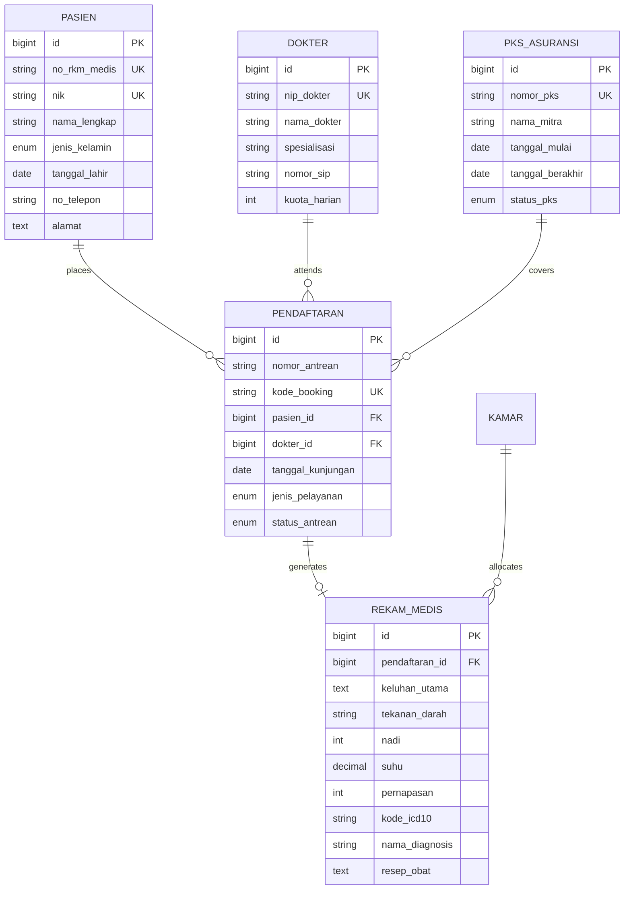

# SIMRS Core — Hospital Management Information System

A modular, PSR-12 compliant Hospital Information System (SIMRS) backend built with **Laravel 11**, **PHP 8.2+**, and **MySQL**. Designed to comply with Indonesian Ministry of Health standards (**Permenkes No. 24/2022** regarding Electronic Medical Records and **SatuSehat FHIR** data structures).

---

## System Overview

This repository provides the core backend architecture for clinical and administrative hospital workflows:

1. **Patient Admission & Online Queue Booking** (`PendaftaranPasienController`): NIK identity validation, automated Medical Record Number (`RM-YYYYMM-XXXX`) generation, specialist doctor quota management, and sequential queue scheduling.
2. **Electronic Medical Records (RME SOAP & ICD-10)** (`RekamMedisController`): Structured clinical data entry (Subjective, Objective vital signs, Assessment with WHO ICD-10 standard codes, and Plan pharmacological prescriptions).
3. **Insurance Cooperation Agreement Tracking (PKS)** (`PksAsuransiController`, `PksNotificationService`): Contract lifecycle tracking for BPJS Kesehatan, BPJS Ketenagakerjaan, and private insurance carriers with automated addendum alerts ($\le 60$ days).
4. **Inpatient Capacity & Barber-Johnson Indicators** (`DashboardController`, `BorCalculatorService`): Calculation of hospital inpatient efficiency metrics including **BOR** (Bed Occupancy Rate), **ALOS** (Average Length of Stay), **TOI** (Turn Over Interval), and **BTO** (Bed Turn Over).

---

## Interactive Web Demo

An interactive browser simulation of the UI and clinical business logic is hosted at:  
👉 **[https://infinitenull.github.io/simrs-laravel/](https://infinitenull.github.io/simrs-laravel/)**

---

## Directory Structure

```text
simrs-laravel/
├── app/
│   ├── Http/
│   │   └── Controllers/
│   │       ├── Api/
│   │       │   └── SimrsApiController.php       # REST API endpoints for SatuSehat / Mobile
│   │       ├── DashboardController.php          # Hospital KPI & BOR summary
│   │       ├── PendaftaranPasienController.php  # Patient admission & queue scheduling
│   │       ├── RekamMedisController.php         # EMR SOAP assessment & ICD-10 diagnosis
│   │       └── PksAsuransiController.php        # Insurance partnership tracking
│   ├── Models/                                  # Eloquent Models with relationships & casts
│   │   ├── Dokter.php
│   │   ├── Kamar.php
│   │   ├── Pasien.php
│   │   ├── Pendaftaran.php
│   │   ├── PksAsuransi.php
│   │   └── RekamMedis.php
│   └── Services/                                # Domain logic isolated from controllers
│       ├── BorCalculatorService.php             # Ministry of Health Barber-Johnson formulas
│       └── PksNotificationService.php           # Expiry threshold calculations
├── database/
│   ├── migrations/                              # 3NF relational schemas with foreign key constraints
│   └── seeders/                                 # Master data for clinics, rooms, and doctors
├── routes/
│   ├── api.php                                  # Versioned API routes (/api/v1/...)
│   └── web.php                                  # Web resource routes
└── README.md
```

---

## Database Architecture (ERD)



---

## Barber-Johnson Formulas (`App\Services\BorCalculatorService`)

* **Bed Occupancy Rate (BOR)**:
  $$\text{BOR} = \frac{\text{Total Inpatient Days}}{\text{Total Usable Beds} \times \text{Period Days}} \times 100\% \quad (\text{Target: } 60\% - 85\%)$$

* **Average Length of Stay (ALOS)**:
  $$\text{ALOS} = \frac{\text{Total Inpatient Days}}{\text{Discharged Patients (Alive + Dead)}} \quad (\text{Target: } 3 - 6 \text{ Days})$$

* **Turn Over Interval (TOI)**:
  $$\text{TOI} = \frac{(\text{Total Usable Beds} \times \text{Period Days}) - \text{Total Inpatient Days}}{\text{Discharged Patients}} \quad (\text{Target: } 1 - 3 \text{ Days})$$

---

## Local Setup

### Requirements:
- PHP >= 8.2
- Composer 2.x
- MySQL 8.0 / MariaDB 10.4+

### Installation:

```bash
# 1. Clone repository
git clone https://github.com/InfiniteNull/simrs-laravel.git
cd simrs-laravel

# 2. Install PHP dependencies
composer install

# 3. Environment configuration
cp .env.example .env
php artisan key:generate

# 4. Configure database credentials in .env, then run migrations and seeders:
php artisan migrate --seed

# 5. Start development server
php artisan serve
```

---

## REST API Endpoints

| Method | Endpoint | Description |
|---|---|---|
| `GET` | `/api/v1/dokters` | Retrieve active doctors, clinic schedules, and remaining quotas |
| `GET` | `/api/v1/kamar/ketersediaan` | Real-time bed occupancy per ward and overall hospital BOR |
| `GET` | `/api/v1/pasien/{no_rm}/histori` | Historical medical records and clinical assessment summaries |
| `GET` | `/api/v1/pks/monitoring` | Status of active insurance cooperation agreements and expiration dates |

---

## License

This project is open-sourced software licensed under the [MIT License](LICENSE).
